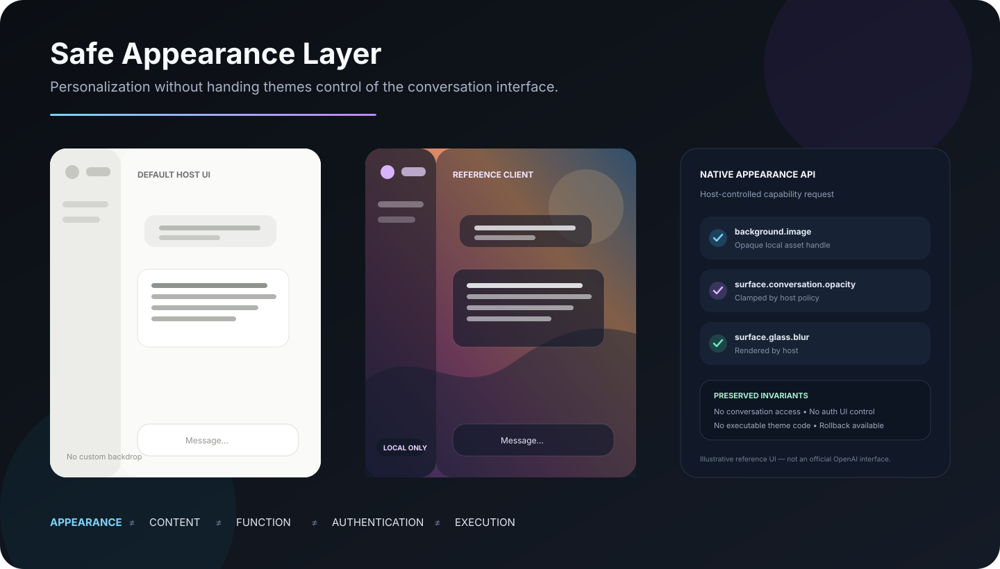
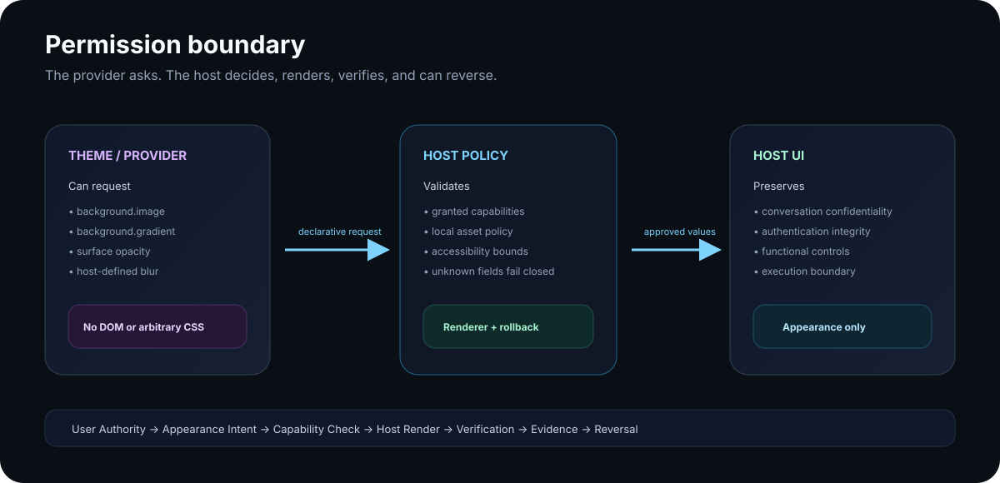

# Safe Appearance Layer

<p align="center">
  <strong>An open reference architecture for safe visual personalization of conversational AI interfaces.</strong>
</p>

<p align="center">
  Appearance can change. Conversation authority should not.
</p>

<p align="center">
  
</p>

> **Core invariant:** Appearance authority must not imply content authority, interface authority, authentication authority, or execution authority.

## What this repository proves

Safe Appearance Layer (SAL) contains two complementary implementations:

1. **A working Chrome/Edge reference client for ChatGPT** that applies local backgrounds, transparency, blur, and readability controls today.
2. **A vendor-neutral Appearance API reference design** showing how a host could provide the same capability natively without giving a theme arbitrary CSS, DOM, conversation, authentication, or execution access.

The browser extension is the compatibility bridge. The native API is the preferred security architecture.

### Try the visual demo

Open [`docs/demo/index.html`](docs/demo/index.html) after cloning or downloading the repository. It is a self-contained interactive mockup with no external assets or network dependencies.

The demo lets you adjust conversation transparency, sidebar transparency, glass blur, readability overlay, and backdrop presets while the functional interface remains unchanged.

## The boundary

<p align="center">
  
</p>

A native host implementation keeps the authority model explicit:

```text
User Authority
    ↓
Appearance Intent
    ↓
Declared Capability Request
    ↓
Host Validation / Policy
    ↓
Host-Rendered Appearance Transition
    ↓
Verification + Invariant Checks
    ↓
Evidence + Reversible State
```

**Appearance ≠ Content ≠ Function ≠ Authentication ≠ Execution**

A theme may request `background.image`. That does not authorize reading conversation text. A request for `surface.sidebar.opacity` does not authorize hiding sidebar controls. Unknown capabilities fail closed.

## Working reference client

The current Chrome/Edge extension demonstrates:

- Local JPG, PNG, or WebP background images
- Solid/gradient fallback backgrounds
- Cover, contain, and tile fit modes
- Background blur
- Readability overlay
- Conversation surface opacity
- Sidebar surface opacity
- Glass/backdrop blur
- One-click reset
- Local-only storage

And deliberately excludes:

- Analytics or telemetry
- Network requests
- Conversation parsing or extraction
- Remote scripts
- Arbitrary user/theme CSS
- Authentication-surface modification
- Functional-control interception

The extension requests only Chrome's `storage` permission and host access for `https://chatgpt.com/*`.

## Native Appearance API reference

The proposed API is declarative. A provider submits a narrow capability request; the host owns validation, rendering, accessibility enforcement, evidence, and rollback.

```json
{
  "schemaVersion": "0.1",
  "themeId": "reference.soft-glass",
  "capabilities": [
    "background.image",
    "surface.conversation.opacity",
    "surface.glass.blur"
  ],
  "appearance": {
    "background": {
      "image": "asset://local/user-selected-background"
    },
    "surfaces": {
      "conversationOpacity": 0.84,
      "glassBlur": 10
    }
  }
}
```

Remote wallpaper URLs are rejected in the v0.1 local-only model. The host resolves opaque local asset handles and can preserve accessibility/readability without exposing the underlying asset or conversation data to the provider.

See [`docs/APPEARANCE_API.md`](docs/APPEARANCE_API.md) for the full reference specification.

## Install the ChatGPT reference client

```bash
npm run check
```

Then:

1. Open `chrome://extensions/` or the equivalent Edge extensions page.
2. Enable **Developer mode**.
3. Choose **Load unpacked**.
4. Select the `extension/` directory.
5. Open ChatGPT.
6. Use the extension popup to choose a local background and appearance settings.

No account connection is required.

## Security model

SAL treats every appearance change as a governed state transition:

```text
Authority → Intent → Preconditions → Capability Boundary → Transition
→ Verification → Invariant Preservation → Evidence → Recovery
```

The native reference validator rejects unknown schema versions, unknown capabilities, unauthorized fields, remote image URLs, invalid values, and capability/value mismatches. Applied transitions return explicit invariant evidence and a rollback path.

Read:

- [`ARCHITECTURE.md`](ARCHITECTURE.md) — system architecture and authority model
- [`THREAT_MODEL.md`](THREAT_MODEL.md) — protected assets, abuse cases, and controls
- [`SECURITY.md`](SECURITY.md) — security invariants and reporting
- [`docs/GOVERNANCE_REVIEW.md`](docs/GOVERNANCE_REVIEW.md) — transition-governance review
- [`docs/OPENAI_PROPOSAL.md`](docs/OPENAI_PROPOSAL.md) — platform proposal
- [`docs/PLATFORM_CONTEXT.md`](docs/PLATFORM_CONTEXT.md) — current platform context

## Test and audit

```bash
npm run check
```

This runs the policy/validator tests and a static local audit that rejects network primitives, code-evaluation primitives, unexpected extension permissions, and accidental remote asset URLs.

Package the extension with:

```bash
npm run package:extension
```

No GitHub Actions workflow is required.

## Project status

**v0.1.0 — public reference implementation.**

The browser reference client necessarily applies styling to the current ChatGPT web interface and may require adapter updates if the host UI changes. The native Appearance API is a reference design, not an existing or supported OpenAI API.

The visual demonstrations in this repository are illustrative reference interfaces, not official OpenAI UI.

This project is not affiliated with or endorsed by OpenAI. ChatGPT is a trademark of OpenAI.

## Contributing

Contributions are welcome, especially around accessibility, host adapters, permission models, threat modeling, and portable appearance schemas. See [`CONTRIBUTING.md`](CONTRIBUTING.md).

## License

MIT. See [`LICENSE`](LICENSE).
